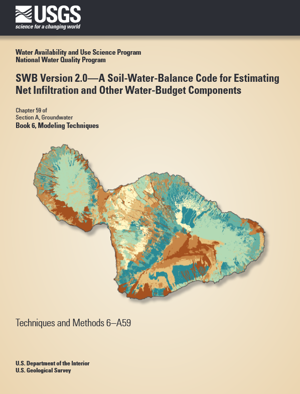
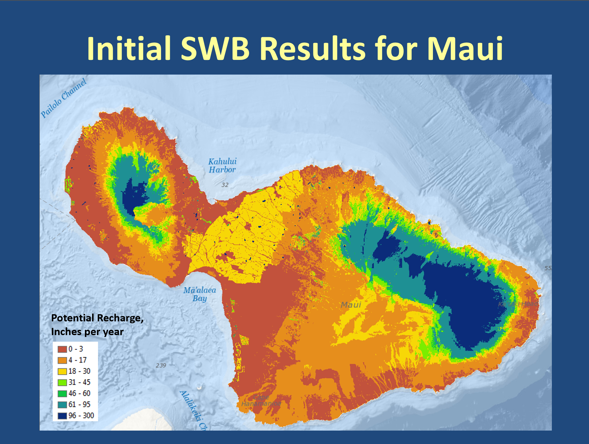

This repository contains a collection of test files that were used to add add functionality from the Hawaii Water Budget code (now known as WATRMod, Oki, 2022) to the Soil-Water-Balance code version 2 (SWB2, Westenbroek and others, 2018). The SWB2 code can closely replicate the output from the Hawaii Water Budget (HWB) Code (version 3.9/3.10 circa 5/11/2018).

SWB2 was heavily modified from the SWB version 1.0 code to make it more useful to application to island enviroments. The internals of SWB2 are such that although a rectangular grid is established for a given project area, all open water cells can be inactivated. 

SWB2 was never applied to any of the Hawaiian Islands, but comparisons with the HWB code showed reasonably close agreement. (See the pdf in the 'docs' subdirectory for a comparison). Below is some example output from SWB2 for net infiltration:

One feature of WATRMod (HWB) is that it is designed to calculate water budget components for a number of realizations (say, 25) of the method of fragments all during a single forward run of the model. The most straightforward way to use SWB2 to process a number of realizations would be to run SWB2 25 separate times (with 25 different fragment sequences) and post-process the output to create an average of the individual realizations. This would be easy enough to do, given modest computing resources, but HWB can do this with a single run on an individual computer.

This repository represents a work-in-progress and nothing in this repository has been officially approved by USGS. Perhaps some of the materials contained here will be useful to someone.

Oki, D.S., 2022, Water-budget accounting for tropical regions model (WATRMod) documentation: U.S. Geological Survey, 77 pp., accessed September 19, 2025, at https://doi.org/10.3133/ofr20221013.

Westenbroek, S.M., Engott, J.A., Kelson, V.A., and Hunt, R.J., 2018, A Soil-Water-Balance code for estimating net infiltration and other water-budget components: U. S. Geological Survey book 6, chap. A59, 118 pp., accessed April 28, 2021, at https://doi.org/10.3133/tm6A59.
